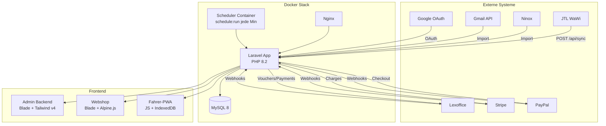
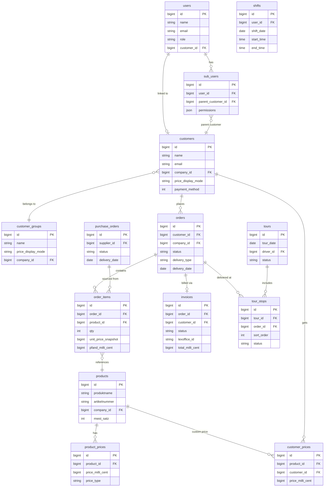
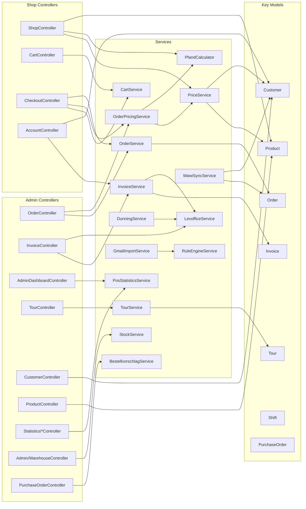
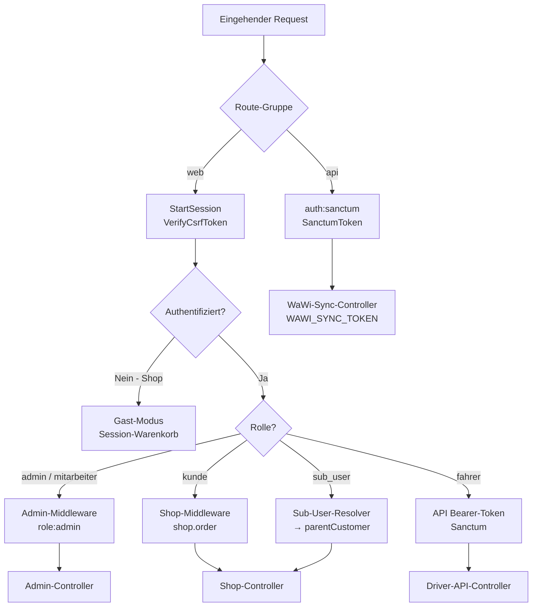
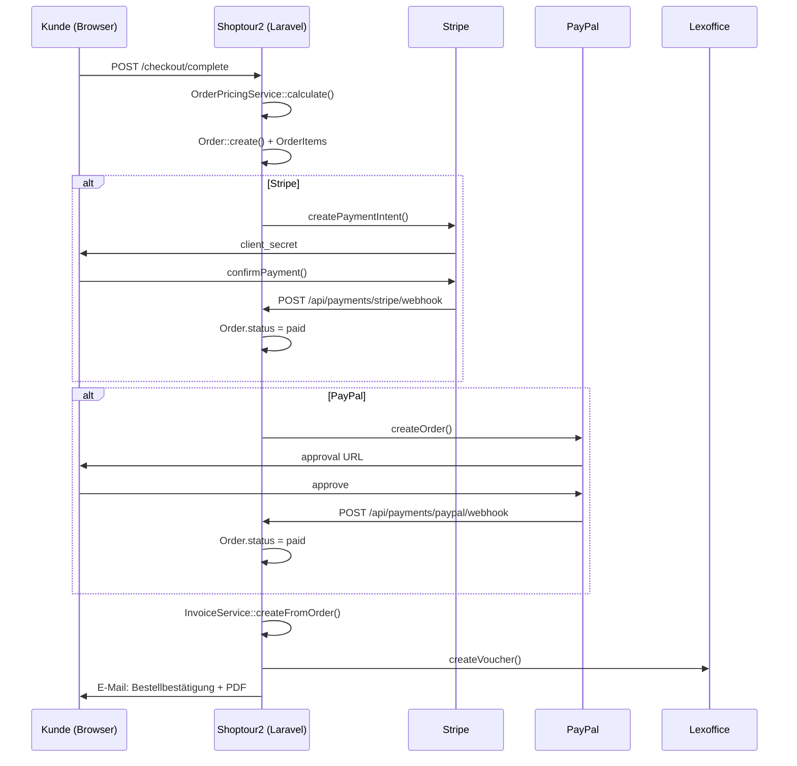

# Shoptour2 — Architektur-Übersicht

> Mermaid-Diagramme für Modulstruktur, Datenfluss und Abhängigkeiten.  
> Stand: April 2026 | Basis: vollständige Code-Analyse

---

## 1. Modulgraph (Systemübersicht)



---

## 2. Datenfluss — Import → Masterdaten → Bestellung → Lieferung → Rechnung → Mahnung

```mermaid
flowchart LR
    subgraph Import["Import-Sync (täglich / push)"]
        W[wawi_dbo_*\nPOS-Daten, Artikel]
        N[ninox_*\nLagerbestand]
        L[lexoffice_*\nVouchers, Contacts]
    end

    subgraph Master["Masterdaten (App-Tabellen)"]
        P[products\nprodukt_images\nproduct_prices]
        C[customers\ncustomer_groups\ncustomer_prices]
        S[suppliers\nsupplier_products]
        CAT[categories\nbrands\npfand_sets]
    end

    subgraph Order["Bestellprozess"]
        CART[CartService\n(Session)]
        ORDER[orders\norder_items\n→ Preis-Snapshot!]
        PAY[payments\nStripe/PayPal/SEPA]
    end

    subgraph Delivery["Lieferung"]
        TOUR[tours\ntour_stops]
        DRIVER[Fahrer-PWA\nOffline-Queue]
        POD[proof_of_delivery\nFotos]
    end

    subgraph Finance["Finanzen"]
        INV[invoices\ninvoice_items]
        LEX[Lexoffice\nSync]
        DUN[dunning_levels\nMahnungen]
    end

    subgraph Stats["Statistiken"]
        POS[stats_pos_daily\n→ refresh täglich 05:00]
        REP[Admin-Reports\nPOS / Artikel / MHD]
    end

    W -->|WawiSyncService| P
    W -->|stats:refresh-pos| POS
    N -->|NinoxSyncService| Master
    L -->|LexofficeService| Finance

    P --> CART
    C --> CART
    CART --> ORDER
    ORDER --> PAY
    ORDER --> TOUR
    TOUR --> DRIVER
    DRIVER --> POD
    ORDER --> INV
    INV --> LEX
    LEX -->|Zahlungsstatus| INV
    INV -->|Überfällig| DUN
    DUN -->|Mahnmail| C

    POS --> REP
    INV --> REP
```

---

## 3. Entity-Relationship — Kernentitäten



---

## 4. Controller → Service → Model Abhängigkeiten



---

## 5. Scheduler-Übersicht (Artisan Commands)

```mermaid
gantt
    title Scheduler — Täglich / Stündlich / Alle 5 Min
    dateFormat HH:mm
    axisFormat %H:%M

    section Alle 5 Min
    kolabri:tasks:run           :00:00, 5m
    lexoffice:import-payments   :00:00, 5m

    section Stündlich
    kolabri:sync:lexoffice      :00:00, 60m

    section Täglich 05:00
    stats:refresh-pos           :05:00, 30m

    section Täglich 06:00
    kolabri:dunning:check       :06:00, 30m

    section Täglich 07:00
    kolabri:reports:daily       :07:00, 30m
```

**Manuelle Commands:**
```bash
php artisan stats:refresh-pos --days=10       # POS-Statistiken für N Tage neu aggregieren
php artisan kolabri:po:create                 # Bestellvorschlag erstellen
php artisan kolabri:tasks:run                 # Deferred Tasks einmalig verarbeiten
php artisan lexoffice:import-payments         # Zahlungsabgleich sofort
php artisan tinker                            # REPL für Debugging
```

---

## 6. Auth & Middleware-Stack



---

## 7. Zahlungsfluss (PROJ-8)



---

## 8. Fahrer-PWA Offline-Architektur

```mermaid
flowchart LR
    subgraph PWA["Fahrer-PWA (Browser)"]
        SW[Service Worker\nsw.js]
        IDB[IndexedDB\nOffline Queue]
        APP_JS[app.js\nAlpine.js + Fetch]
    end

    subgraph Server["Laravel API"]
        API[/api/driver/tours\n/api/driver/sync]
        AUTH[Sanctum Bearer Token]
    end

    APP_JS -->|Online| API
    APP_JS -->|Offline - Write| IDB
    SW -->|Background Sync| IDB
    IDB -->|Sync wenn online| API
    API --> AUTH

    subgraph Actions["Fahrer-Aktionen"]
        SCAN[Lieferung bestätigen]
        PHOTO[PoD-Foto hochladen]
        CASH[Kassenentnahme]
        DEV[Abweichung melden]
    end

    SCAN --> APP_JS
    PHOTO --> APP_JS
    CASH --> APP_JS
    DEV --> APP_JS
```

---

*Stand: 2026-04-28 | Projekt: shoptour2 | Basis: vollständige Code-Analyse*
